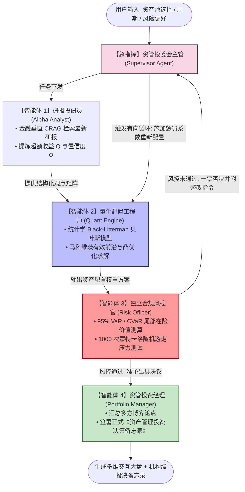

# FinAsset-Agent: 资管投委会多智能体协同投研与资产配置系统

[](https://www.python.org/downloads/)
[-orange.svg)](https://github.com/langchain-ai/langgraph)
[](https://scipy.org/)
[](LICENSE)

> **面向证券、财富管理与基金资产管理领域的机构级开源多智能体投决系统。**  
> 模拟买方机构（公募基金/券商资管）投委会决策流，依托 **LangGraph** 构建包含 **Supervisor 主管、研报投研员、量化工程师、独立风控官与资管投资经理** 的有向有环博弈拓扑（Cyclic Multi-Agent Graph）。系统融合**金融垂直校正性 RAG (CRAG)** 与统计学皇冠级 **Black-Litterman 贝叶斯资产配置模型**，并引入蒙特卡洛压力测试与风控一票否决反思闭环。

---

## 📌 行业背景与核心痛点

在证券财富管理与资管投研领域，企业数字化转型面临三大核心痛点：
1. **研报文本与量化配置严重割裂**：传统投研依赖人工阅读海量研报，主观定性分析难以与客观定量资产配置模型（如马科维茨有效前沿）进行数理融合；
2. **大模型数值计算幻觉严重**：直接使用大模型生成投资组合极易出现“张口就来”的虚假数据，缺乏统计学严谨性与确定性数学边界；
3. **传统线性智能体缺乏自我风控纠错能力**：线性的单向流水线无法应对真实业务中因在险价值（VaR）或集中度超标触发的**驳回重整（Re-planning）**需求。

**FinAsset-Agent** 创新性地构建了**“主管调度 + 辩论博弈 + 贝叶斯融合 + 动态反思循环”**的端到端资产管理决策闭环。

---

## 🏗️ 投委会多智能体有环拓扑架构 (Cyclic Multi-Agent Graph)



### 系统关键机制：
1. **主管调度与动态反思 (Supervisor & Feedback Loop)**：当独立风控官测算发现组合 VaR 超标或持仓集中度突破 35% 红线时，触发条件边打回，系统自适应调整风险惩罚因子 $\Delta \delta$，收紧优化边界重新求解；
2. **校正性金融 RAG (CRAG)**：包含两阶段研报切片检索，自检检索置信度，若信息不足则触发查询重写扩展，确保观点输入客观真实；
3. **代码即真理 (Code-as-Truth)**：大模型不参与数值计算，所有协方差矩阵、贝叶斯后验、凸优化及蒙特卡洛模拟由底层 Python 科学计算库确定性执行。

---

## 🧮 统计学与金融工程方法论

### 1. 市场均衡先验收益率推导 (CAPM Reverse Optimization)
在无主观观点介入前，计算市场均衡收益率向量 $\Pi$：

$$
\Pi = \delta \Sigma w_{\text{mkt}}
$$

其中 $\delta$ 为市场风险厌恶系数，$\Sigma$ 为资产年化协方差矩阵，$w_{\text{mkt}}$ 为市场基准权重。

### 2. Black-Litterman 贝叶斯后验融合模型
将大模型从研报中提炼出的观点矩阵 $P$、预期超额收益向量 $Q$ 与观点不确定性协方差 $\Omega$ 融入先验分布，求解后验期望收益率向量 $E(R)$：

$$
E(R) = \left[ (\tau \Sigma)^{-1} + P^T \Omega^{-1} P \right]^{-1} \left[ (\tau \Sigma)^{-1} \Pi + P^T \Omega^{-1} Q \right]
$$

### 3. 马科维茨投资组合凸优化 (Mean-Variance SLSQP)
求解最大化夏普比率组合与有效前沿曲线：

$$
\min_w \frac{1}{2} w^T \Sigma_{\text{post}} w - \lambda w^T E(R) \quad \text{s.t.} \quad \sum_{i=1}^n w_i = 1, \quad 0 \le w_i \le w_{\text{max}}
$$

### 4. 蒙特卡洛压力测试 (Monte Carlo Stress Testing)
基于几何布朗运动（Geometric Brownian Motion, GBM）进行 1,000 条未来 60 个交易日的随机价格路径模拟：

$$
S_{t+1} = S_t \exp\left( \left( \mu - \frac{1}{2}\sigma^2 \right) \Delta t + \sigma \sqrt{\Delta t} Z \right), \quad Z \sim \mathcal{N}(0, 1)
$$

输出 5% 极端悲观分位至 95% 乐观分位的情景扇形图（Fan Chart）。

---

## 📂 项目工程目录结构

```
FinAsset-Agent/
├── data/
│   ├── reports/                          # 本地金融研报知识库 (科技/新能源/消费/银行/黄金)
│   ├── generate_market_data.py           # 市场真实行情与收益率时间序列生成器
│   └── market_prices.csv                 # 5大类资产日频历史行情数据 (252交易日)
├── src/
│   ├── __init__.py
│   ├── config.py                         # 全局量化超参数 (无风险利率, VaR阈值, API设置)
│   ├── state.py                          # 投委会多智能体强类型状态契约 (InvestmentState)
│   ├── rag_engine.py                     # 金融垂直校正性 RAG (CRAG) 引擎
│   ├── quant_engine.py                   # 统计学 Black-Litterman 贝叶斯与凸优化核心引擎
│   ├── risk_engine.py                    # 机构级风控指标计算与 1000 次蒙特卡洛压力测试
│   ├── workflow.py                       # LangGraph 有向有环多智能体状态机
│   ├── report_template.py                # 投资备忘录生成器 (支持离线确定性与在线模式)
│   └── agents/
│       ├── __init__.py
│       ├── supervisor.py                 # 投委会主管调度 Agent
│       ├── alpha_analyst.py              # 研报投研分析 Agent
│       ├── quant_analyst.py              # 量化配置工程师 Agent
│       ├── risk_officer.py               # 独立合规风控官 Agent (一票否决)
│       └── portfolio_manager.py          # 资管投资经理 Agent (报告签署)
├── app.py                                # Streamlit + Plotly 机构级可视化交互终端
├── run_cli.py                            # 命令行一键仿真测试套件
├── requirements.txt                      # 依赖清单
├── LICENSE                               # MIT 开源许可证
└── README.md                             # 线上公开技术文档
```

---

## 🚀 快速上手与本地运行

### 1. 安装依赖环境
```bash
pip install -r requirements.txt
```

### 2. 生成多资产历史行情数据
```bash
python data/generate_market_data.py
```

### 3. 命令行一键投委会仿真测试
```bash
python run_cli.py
```

### 4. 启动 Web 机构级资产管理终端
```bash
python -m streamlit run app.py
```
> 系统内置双模机制：在未配置 API Key 时自动启用**本地金融工程级确定性渲染引擎**，百分之百保证稳定运行与图表交互；配置 Key 后可联动大模型生成更加生动的投决叙事。

---

## 👨‍💻 作者与学术背景 (Author & Affiliation)

* **开发者**：Jiawen (嘉文) · 统计学硕士研究生 (Master of Statistics)
* **研究机构**：浙江工商大学 · 统计与数学学院
* **研究方向**：数理统计推断、大模型 Agent 状态机架构、金融工程与资产配置、量化风控

---

## 📄 版权与开源协议 (License)

本项目采用 [MIT License](LICENSE) 开源协议。所有数理推导模型、状态机架构设计与实现代码版权归原作者所有，欢迎学术研究与交流探讨。
